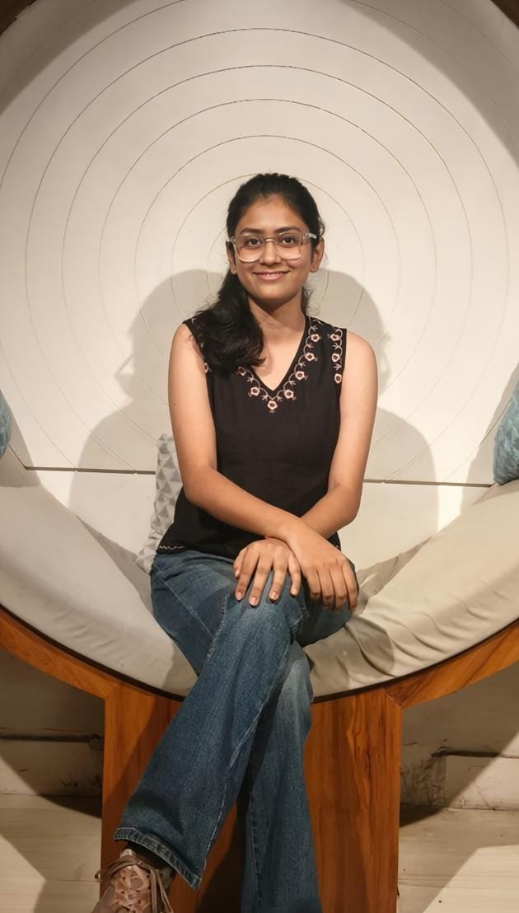

My name is Chinmayee Chaudhari, and I am currently a second-year student in the Department of Electronics and Electrical Communication Engineering. My interests are building circuits, understanding how they work and learning a lot of new things. In my free time, I enjoy cooking, watching movies, playing table tennis and drawing/arts related stuff. The programming language I enjoy coding in is C++. I’m known for being a cheerful person and rarely run out of reasons to smile.

