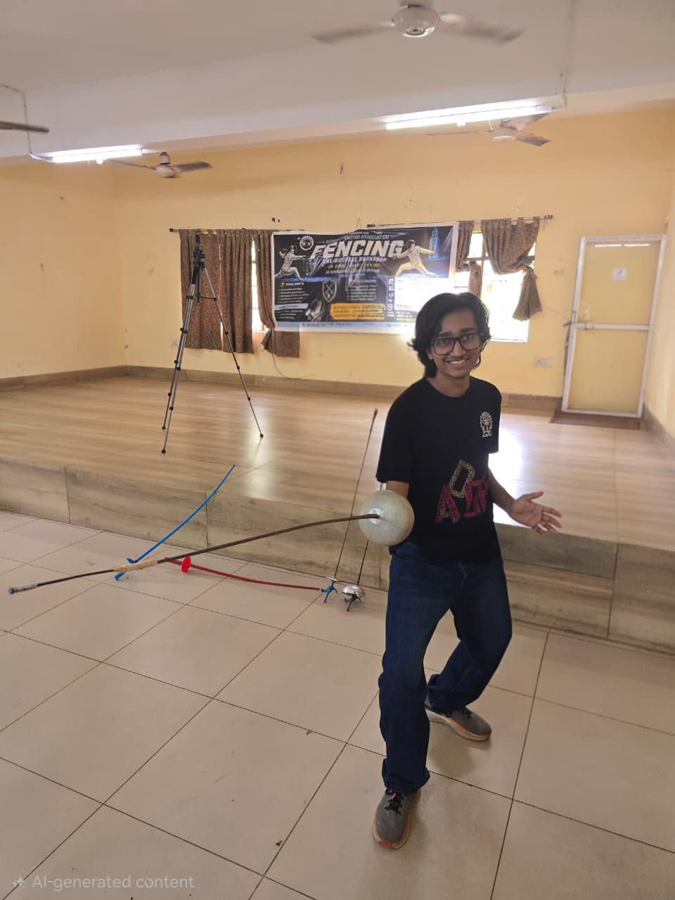

My name is Harrick Bharmal , and I am a second-year undergraduate student in the 
Department of Electronics and Electrical Communication Engineering enrolled in it's Btech course.

I have been playing sports eversince i was little, first it was skating, then football,cricket,
long tennis, swimming, and finally returned to skating again. I participated in a state level 
skating competition in 10th standard and came utterly last in qualifiers😭. 
I also like to binge watch movies and webseries, and Kdramas.{Haven't started C-dramas yet}
I used to be an anime nerd recently, but now I mostly read Manhwas and Manhuas.
My favorite manhua was Tales of Demons and God's , but the author has a curse so i dropped it💀.
My fav anime is Akame ga Kill!.

As much as i procastinate going out, i actually like it. I've been on a skiing camp,
Rock climbing camp (both when i was underage), so I'd say I'm a pretty adventurous person.

Apart from that, one interesting thing about me is that
` I swum in a sea/ocean once, and i used to swim in rivers quite often, until recently. ` (never got to 
go for a second time in the ocean)

I forget things way too easily, maybe that's why my introduction ended up being this unorganized. 😭