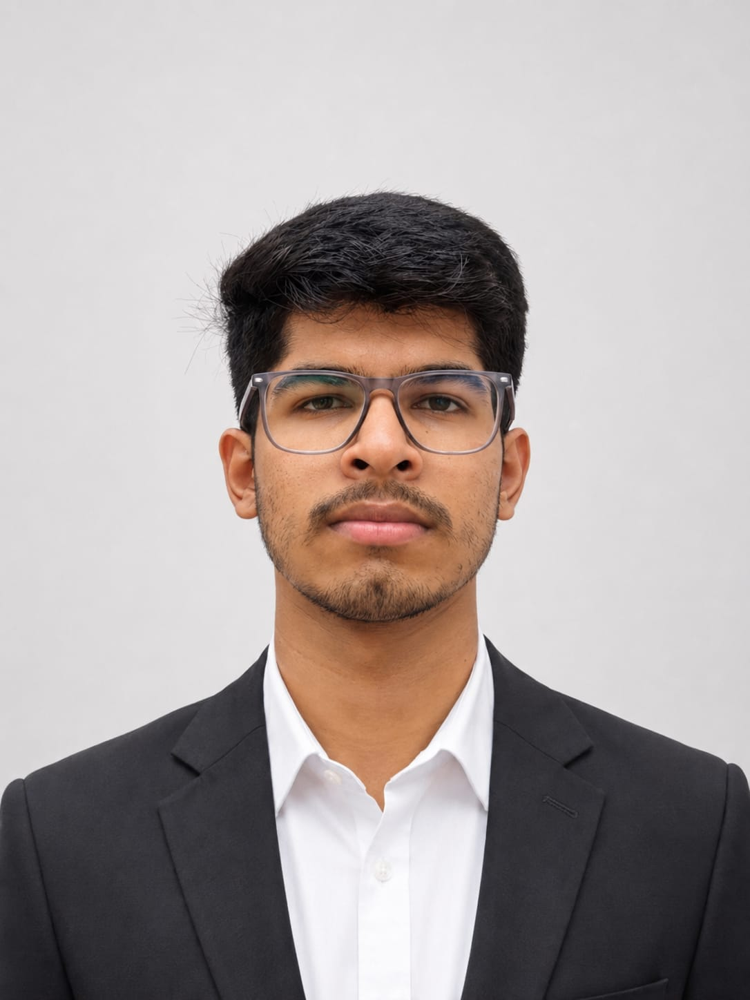

Hi, this is Hemang Katare, a second-year undergraduate in Mechanical Engineering at IIT Kharagpur, currently residing in the RP Hall of Residence. I have a deep curiosity for understanding how things actually work—especially the mechanical principles behind machines—which I balance with traveling, swimming, and exploring nature. Passionate about robotics and competitive programming, I primarily code in C++ and Python. Looking toward the future, I aim to pursue an MS degree, driven by my fascination with lifestyles abroad. I'm just curious and open-minded about where that journey might take me, whether it leads to a role in Software Engineering (SWE), Product Management, or a research and development (R&D) field. I often reflect on the diverse ways people chase their goals, noticing that procrastination is usually what separates those who realize their dreams from those who fall behind. To ensure I stay on track, I focus on making steady progress every single day, guided by my core belief that hard work beats talent when talent doesn't work hard.

