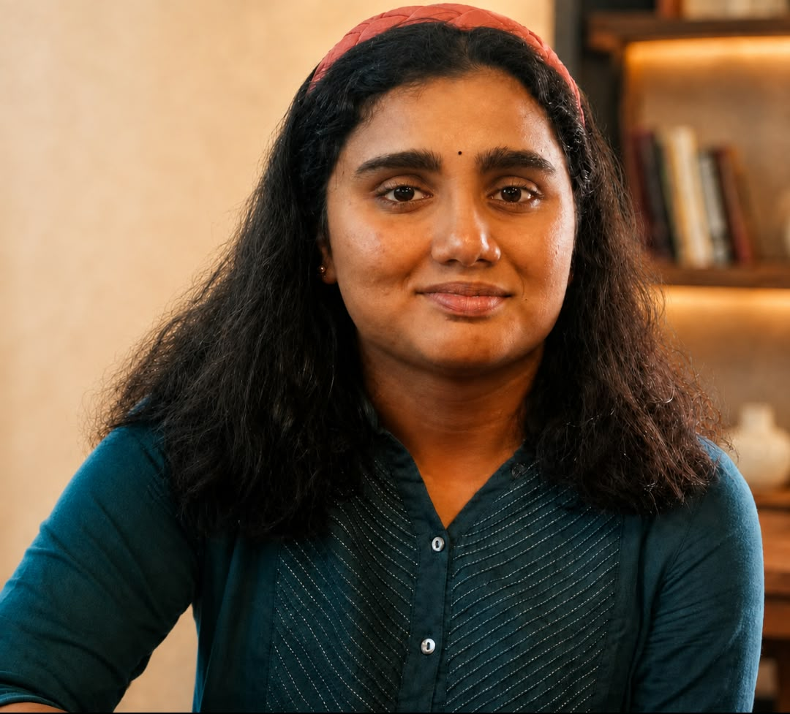

My name is Kavyamrutha Oruganti (Kavya). I am a second year Undergraduate student of the Department of Electrical Engineering at IIT KGP. Describing my interests is as hard as choosing a single browser tab to be kept open while the rest 20 compete for attention.

well, let's say curiosity drew my clumsy mind into a forest of possibilities and now I stand at the diverging pathways, staring into the abyss, utterly unsure of which one to pick.

At the core, I aspire to bring brain–computer interfaces, quantum computing, AI/ML, signal processing, efficient data processing, and neuroscience under a single roof—exploring the potential of non-invasive BCI systems and, eventually, skill induction.

I strongly believe that there may come a point when linking the human brain directly with AI and search agents through BCI becomes necessary for us to keep pace with technological growth, while also reducing the risk of humanity being outpaced by the ai systems. I envision this beginning as a research ecosystem and eventually growing into an enterprise.

Quantitative finance, robotics, and mathematically grounded theories of the universe fascinate me just as much. The list is long and that is exactly the reason I never be manage to be able to provide a straight forward answer to the question. It is rather ironic at this point that I possess enough self-doubt to make even the simplest turn feel impossibly complicated.

My current hobbies include reading random books (self help, cube solving) and sleeping. I am only aware of c, python and a little c++, so I really don't know what my favourite among them is. Probably I prefer python.

